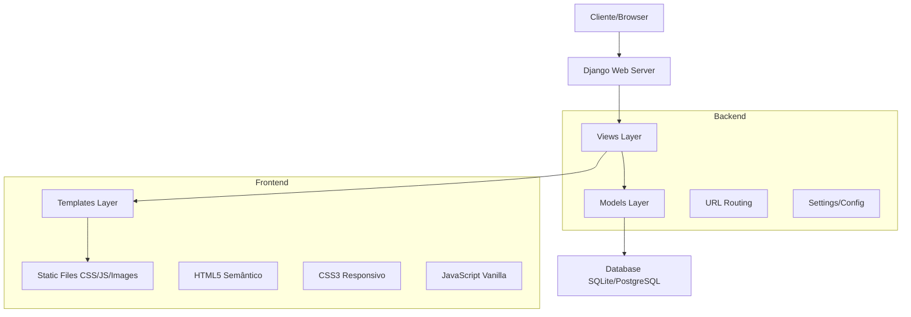
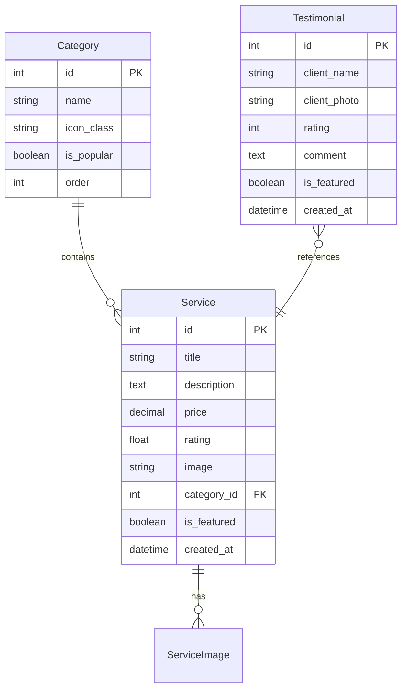

# Documento de Design - ServiFix Homepage

## Visão Geral

O projeto ServiFix Homepage será desenvolvido como uma aplicação Django fullstack que replica a funcionalidade e design da página principal do ServiFix. A arquitetura seguirá o padrão MVC do Django com separação clara entre frontend e backend, priorizando responsividade, performance e manutenibilidade.

## Arquitetura

### Arquitetura Geral do Sistema



### Estrutura do Projeto Django

```
servifix_homepage/
├── manage.py
├── requirements.txt
├── README.md
├── .env.example
├── servifix_project/
│   ├── __init__.py
│   ├── settings/
│   │   ├── __init__.py
│   │   ├── base.py
│   │   ├── development.py
│   │   └── production.py
│   ├── urls.py
│   └── wsgi.py
├── homepage/
│   ├── __init__.py
│   ├── admin.py
│   ├── apps.py
│   ├── models.py
│   ├── views.py
│   ├── urls.py
│   └── migrations/
├── static/
│   ├── css/
│   │   ├── base.css
│   │   ├── components.css
│   │   └── responsive.css
│   ├── js/
│   │   ├── main.js
│   │   └── components.js
│   └── images/
│       ├── logo.png
│       ├── icons/
│       └── services/
└── templates/
    ├── base.html
    ├── homepage/
    │   └── index.html
    └── components/
        ├── header.html
        ├── footer.html
        └── service_card.html
```

## Componentes e Interfaces

### 1. Models (Camada de Dados)

#### Service Model
```python
class Service(models.Model):
    title = models.CharField(max_length=200)
    description = models.TextField()
    price = models.DecimalField(max_digits=10, decimal_places=2)
    rating = models.FloatField(default=0.0)
    image = models.ImageField(upload_to='services/')
    category = models.ForeignKey('Category', on_delete=models.CASCADE)
    is_featured = models.BooleanField(default=False)
    created_at = models.DateTimeField(auto_now_add=True)
```

#### Category Model
```python
class Category(models.Model):
    name = models.CharField(max_length=100)
    icon_class = models.CharField(max_length=50)  # CSS class para ícones
    is_popular = models.BooleanField(default=False)
    order = models.IntegerField(default=0)
```

#### Testimonial Model
```python
class Testimonial(models.Model):
    client_name = models.CharField(max_length=100)
    client_photo = models.ImageField(upload_to='testimonials/')
    rating = models.IntegerField(choices=[(i, i) for i in range(1, 6)])
    comment = models.TextField()
    is_featured = models.BooleanField(default=False)
    created_at = models.DateTimeField(auto_now_add=True)
```

### 2. Views (Camada de Controle)

#### HomepageView
```python
class HomepageView(TemplateView):
    template_name = 'homepage/index.html'
    
    def get_context_data(self, **kwargs):
        context = super().get_context_data(**kwargs)
        context.update({
            'featured_services': Service.objects.filter(is_featured=True)[:3],
            'popular_categories': Category.objects.filter(is_popular=True)[:6],
            'testimonials': Testimonial.objects.filter(is_featured=True)[:3],
            'how_it_works_steps': self.get_how_it_works_steps(),
        })
        return context
```

### 3. Templates (Camada de Apresentação)

#### Estrutura de Templates
- **base.html**: Template base com estrutura HTML comum
- **homepage/index.html**: Template principal da homepage
- **components/**: Templates reutilizáveis para componentes

#### Seções da Homepage
1. **Header**: Logo, navegação, botões de ação
2. **Hero Section**: Banner principal com call-to-action
3. **Categories**: Grid de categorias populares
4. **Featured Services**: Cards dos serviços em destaque
5. **How It Works**: Processo em 3 passos
6. **Testimonials**: Depoimentos de clientes
7. **Mobile App**: Seção de download do aplicativo
8. **Footer**: Links, informações de contato

## Modelos de Dados

### Relacionamentos


## Tratamento de Erros

### Estratégias de Error Handling

1. **Template Error Pages**
   - 404.html para páginas não encontradas
   - 500.html para erros internos do servidor
   - Fallbacks graceful para imagens não encontradas

2. **JavaScript Error Handling**
   - Try-catch blocks para operações assíncronas
   - Fallbacks para funcionalidades que dependem de JavaScript
   - Logging de erros no console para debugging

3. **Django Error Handling**
   - Middleware customizado para logging de erros
   - Validação de dados nos models e forms
   - Tratamento de exceções nas views

## Estratégia de Testes

### Tipos de Testes

1. **Testes Unitários (Django)**
   ```python
   # tests/test_models.py
   class ServiceModelTest(TestCase):
       def test_service_creation(self):
           # Testa criação de serviços
   
   # tests/test_views.py
   class HomepageViewTest(TestCase):
       def test_homepage_loads(self):
           # Testa carregamento da homepage
   ```

2. **Testes de Template**
   - Verificação de renderização correta
   - Testes de contexto passado para templates
   - Validação de HTML gerado

3. **Testes de Frontend**
   - Testes de responsividade em diferentes dispositivos
   - Validação de interatividade JavaScript
   - Testes de acessibilidade

4. **Testes de Integração**
   - Fluxo completo de navegação
   - Testes de performance de carregamento
   - Validação de SEO básico

### Ferramentas de Teste
- **Django TestCase** para testes de backend
- **Coverage.py** para cobertura de código
- **Lighthouse** para testes de performance e acessibilidade
- **HTML Validator** para validação de markup

## Design Responsivo

### Breakpoints
```css
/* Mobile First Approach */
/* Base: 320px+ */
@media (min-width: 768px) { /* Tablet */ }
@media (min-width: 1024px) { /* Desktop */ }
@media (min-width: 1440px) { /* Large Desktop */ }
```

### Layout Strategy
- **Mobile**: Stack vertical, navegação colapsável
- **Tablet**: Grid 2 colunas, navegação horizontal
- **Desktop**: Grid 3-4 colunas, layout completo

### CSS Architecture
```css
/* Metodologia BEM para nomenclatura */
.service-card { }
.service-card__image { }
.service-card__title { }
.service-card--featured { }
```

## Performance e Otimização

### Frontend Optimization
1. **CSS**: Minificação, critical CSS inline
2. **JavaScript**: Lazy loading, code splitting
3. **Images**: WebP format, responsive images, lazy loading
4. **Fonts**: Font display swap, preload critical fonts

### Django Optimization
1. **Database**: Query optimization, select_related/prefetch_related
2. **Caching**: Template fragment caching, view caching
3. **Static Files**: Compression, CDN ready
4. **Settings**: Debug=False em produção, allowed hosts configurado

## Configuração de Ambiente

### Development Settings
```python
# settings/development.py
DEBUG = True
ALLOWED_HOSTS = ['localhost', '127.0.0.1']
DATABASES = {
    'default': {
        'ENGINE': 'django.db.backends.sqlite3',
        'NAME': BASE_DIR / 'db.sqlite3',
    }
}
```

### Production Settings
```python
# settings/production.py
DEBUG = False
ALLOWED_HOSTS = ['yourdomain.com']
DATABASES = {
    'default': {
        'ENGINE': 'django.db.backends.postgresql',
        # PostgreSQL config
    }
}
```

## Acessibilidade

### Implementações WCAG 2.1
1. **Semântica**: Tags HTML apropriadas (header, nav, main, section, article)
2. **Navegação**: Skip links, focus management
3. **Contraste**: Ratio mínimo 4.5:1 para texto normal
4. **Alt Text**: Descrições significativas para imagens
5. **Keyboard Navigation**: Todos os elementos interativos acessíveis via teclado

### Atributos ARIA
```html
<button aria-label="Abrir menu de navegação" aria-expanded="false">
<section aria-labelledby="services-heading">

```

## Integração e Deploy

### Processo de Deploy
1. **Coleta de Static Files**: `python manage.py collectstatic`
2. **Migrações**: `python manage.py migrate`
3. **Testes**: Execução da suite de testes
4. **Environment Variables**: Configuração via .env

### Dependências Principais
```txt
Django>=4.2.0
Pillow>=10.0.0  # Para ImageField
python-decouple>=3.8  # Para variáveis de ambiente
whitenoise>=6.5.0  # Para servir arquivos estáticos
```