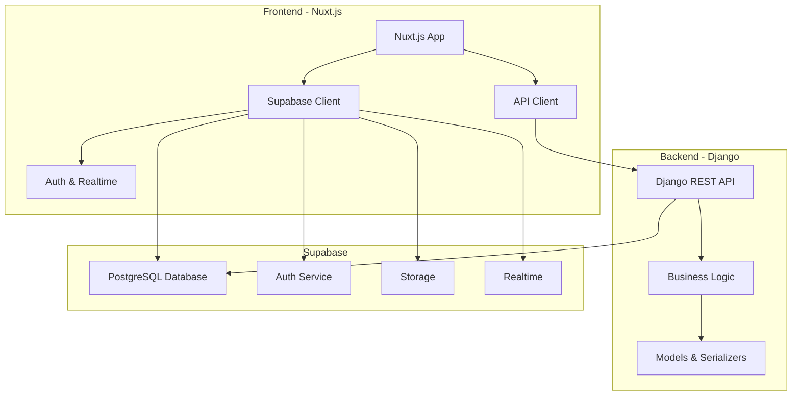

# Documento de Design - Serviflix

## Visão Geral

O Serviflix é uma plataforma full-stack que utiliza uma arquitetura moderna e escalável:
- **Frontend**: Nuxt.js 3 com TypeScript para interface responsiva e SEO otimizado
- **Backend**: Django REST Framework para APIs robustas e lógica de negócio
- **Banco de Dados**: Supabase para dados, autenticação e storage
- **Autenticação**: Supabase Auth com integração Google OAuth

A arquitetura segue o padrão de separação entre frontend e backend, com comunicação via APIs REST e WebSockets para funcionalidades em tempo real.

## Arquitetura



### Fluxo de Dados

1. **Autenticação**: Nuxt.js → Supabase Auth → Google OAuth (opcional)
2. **Dados Públicos**: Nuxt.js → Supabase diretamente (catálogo, avaliações)
3. **Lógica de Negócio**: Nuxt.js → Django API → Supabase (agendamentos, pagamentos)
4. **Tempo Real**: Supabase Realtime → Nuxt.js (notificações, status)

## Componentes e Interfaces

### Frontend (Nuxt.js)

#### Estrutura de Páginas
```
pages/
├── index.vue                 # Landing page
├── auth/
│   ├── login.vue            # Login/Registro
│   └── callback.vue         # OAuth callback
├── dashboard/
│   ├── client.vue           # Dashboard cliente
│   └── provider.vue         # Dashboard prestador
├── services/
│   ├── index.vue            # Catálogo de serviços
│   ├── [id].vue             # Detalhes do serviço
│   └── book/[id].vue        # Agendamento
├── profile/
│   ├── index.vue            # Perfil do usuário
│   └── edit.vue             # Editar perfil
└── admin/
    └── dashboard.vue         # Painel administrativo
```

#### Componentes Principais
```typescript
// components/
├── UI/
│   ├── Button.vue           # Botão customizado com cores do tema
│   ├── Card.vue             # Cards para serviços
│   ├── Modal.vue            # Modais reutilizáveis
│   └── Input.vue            # Inputs com validação
├── Service/
│   ├── ServiceCard.vue      # Card de serviço no catálogo
│   ├── ServiceDetails.vue   # Detalhes completos do serviço
│   └── BookingForm.vue      # Formulário de agendamento
├── User/
│   ├── ProfileCard.vue      # Card do perfil do prestador
│   ├── ReviewCard.vue       # Card de avaliação
│   └── AuthForm.vue         # Formulário de login/registro
└── Layout/
    ├── Header.vue           # Cabeçalho com navegação
    ├── Footer.vue           # Rodapé
    └── Sidebar.vue          # Menu lateral para dashboards
```

#### Configuração do Tema
```typescript
// tailwind.config.js
module.exports = {
  theme: {
    extend: {
      colors: {
        primary: '#0284C7',      // Cor primária (azul)
        secondary: '#EFF6FF',    // Cor secundária (azul claro)
        accent: '#FFAF00',       // Cor para botões (amarelo/laranja)
        'accent-alt': '#1D4ED8', // Cor alternativa para botões (azul escuro)
        text: '#1F2937'          // Cor do texto (cinza escuro)
      },
      fontFamily: {
        'sans': ['Inter', 'system-ui', 'sans-serif']
      },
      backgroundImage: {
        'gradient-primary': 'linear-gradient(135deg, #0284C7 0%, #1D4ED8 100%)',
        'gradient-secondary': 'linear-gradient(135deg, #EFF6FF 0%, #DBEAFE 100%)'
      }
    }
  }
}
```

#### Estrutura Visual da Landing Page

```vue
<!-- pages/index.vue - Estrutura principal -->
<template>
  <div class="min-h-screen">
    <!-- Header fixo -->
    <Header />
    
    <!-- Banner principal com vídeo -->
    <section class="relative h-screen overflow-hidden">
      <video autoplay muted loop class="absolute inset-0 w-full h-full object-cover">
        <source src="~/assets/videos/video-baner-principal.mp4" type="video/mp4">
      </video>
      <div class="absolute inset-0 bg-black bg-opacity-40"></div>
      <div class="relative z-10 flex items-center justify-center h-full text-white text-center">
        <div class="max-w-4xl px-4">
          <h1 class="text-5xl font-bold mb-6">Encontre os melhores profissionais</h1>
          <p class="text-xl mb-8">Conectamos você com prestadores de serviços qualificados</p>
          <button class="bg-accent hover:bg-accent/90 text-white px-8 py-4 rounded-lg text-lg font-semibold">
            Encontrar Serviços
          </button>
        </div>
      </div>
    </section>

    <!-- Categorias Populares -->
    <section class="py-16 bg-secondary">
      <div class="container mx-auto px-4">
        <h2 class="text-3xl font-bold text-center text-text mb-12">Categorias Populares</h2>
        <div class="grid grid-cols-2 md:grid-cols-3 lg:grid-cols-6 gap-6">
          <!-- Cards de categorias com ícones -->
        </div>
      </div>
    </section>

    <!-- Principais Serviços Pedidos -->
    <section class="py-16">
      <div class="container mx-auto px-4">
        <h2 class="text-3xl font-bold text-center text-text mb-12">Principais serviços pedidos</h2>
        <div class="grid md:grid-cols-2 lg:grid-cols-3 gap-8">
          <!-- Cards de serviços com preços e avaliações -->
        </div>
      </div>
    </section>

    <!-- Como Funciona -->
    <section class="py-16 bg-secondary">
      <div class="container mx-auto px-4">
        <h2 class="text-3xl font-bold text-center text-text mb-12">Como funciona</h2>
        <div class="grid md:grid-cols-3 gap-8">
          <div class="text-center">
            <div class="w-16 h-16 bg-primary rounded-full flex items-center justify-center mx-auto mb-4">
              <span class="text-white text-2xl font-bold">1</span>
            </div>
            <h3 class="text-xl font-semibold mb-2">Solicite um serviço</h3>
            <p class="text-gray-600">Descreva o que você precisa</p>
          </div>
          <div class="text-center">
            <div class="w-16 h-16 bg-primary rounded-full flex items-center justify-center mx-auto mb-4">
              <span class="text-white text-2xl font-bold">2</span>
            </div>
            <h3 class="text-xl font-semibold mb-2">Compare qualificações</h3>
            <p class="text-gray-600">Veja perfis e avaliações</p>
          </div>
          <div class="text-center">
            <div class="w-16 h-16 bg-primary rounded-full flex items-center justify-center mx-auto mb-4">
              <span class="text-white text-2xl font-bold">3</span>
            </div>
            <h3 class="text-xl font-semibold mb-2">Serviços realizados</h3>
            <p class="text-gray-600">Contrate e avalie o serviço</p>
          </div>
        </div>
      </div>
    </section>

    <!-- Depoimentos -->
    <section class="py-16">
      <div class="container mx-auto px-4">
        <h2 class="text-3xl font-bold text-center text-text mb-12">O que nossos clientes dizem</h2>
        <div class="grid md:grid-cols-3 gap-8">
          <!-- Cards de depoimentos -->
        </div>
      </div>
    </section>

    <!-- Download do App -->
    <section class="py-16 bg-primary text-white">
      <div class="container mx-auto px-4">
        <div class="flex items-center justify-between">
          <div class="flex-1">
            <h2 class="text-3xl font-bold mb-4">Baixe nosso aplicativo</h2>
            <p class="text-xl mb-8">Tenha acesso a todos os serviços na palma da sua mão</p>
            <div class="flex space-x-4">
              <button class="bg-black text-white px-6 py-3 rounded-lg">App Store</button>
              <button class="bg-black text-white px-6 py-3 rounded-lg">Google Play</button>
            </div>
          </div>
          <div class="flex-1 text-center">
            
          </div>
        </div>
      </div>
    </section>

    <!-- Por que escolher o Serviflix -->
    <section class="py-16 bg-gray-50">
      <div class="container mx-auto px-4">
        <h2 class="text-3xl font-bold text-center text-text mb-12">Por que escolher o Serviflix</h2>
        <div class="grid md:grid-cols-2 lg:grid-cols-4 gap-8">
          <div class="text-center">
            <h3 class="text-xl font-semibold mb-2">Profissionais verificados</h3>
            <p class="text-gray-600">Todos os prestadores são verificados</p>
          </div>
          <div class="text-center">
            <h3 class="text-xl font-semibold mb-2">Preços justos</h3>
            <p class="text-gray-600">Compare preços e escolha o melhor</p>
          </div>
          <div class="text-center">
            <h3 class="text-xl font-semibold mb-2">Avaliações reais</h3>
            <p class="text-gray-600">Veja avaliações de outros clientes</p>
          </div>
          <div class="text-center">
            <h3 class="text-xl font-semibold mb-2">Suporte 24/7</h3>
            <p class="text-gray-600">Estamos sempre aqui para ajudar</p>
          </div>
        </div>
      </div>
    </section>

    <!-- Footer -->
    <Footer />
  </div>
</template>
```

### Backend (Django)

#### Estrutura de Apps
```
serviflix_backend/
├── accounts/                # Gestão de usuários
├── services/               # Catálogo de serviços
├── bookings/               # Sistema de agendamentos
├── payments/               # Processamento de pagamentos
├── reviews/                # Sistema de avaliações
├── notifications/          # Sistema de notificações
└── core/                   # Configurações e utilitários
```

#### APIs Principais
```python
# URLs principais
urlpatterns = [
    path('api/v1/auth/', include('accounts.urls')),
    path('api/v1/services/', include('services.urls')),
    path('api/v1/bookings/', include('bookings.urls')),
    path('api/v1/payments/', include('payments.urls')),
    path('api/v1/reviews/', include('reviews.urls')),
    path('api/v1/notifications/', include('notifications.urls')),
]
```

### Integração Supabase

#### Configuração no Nuxt.js
```typescript
// nuxt.config.ts
export default defineNuxtConfig({
  modules: ['@nuxtjs/supabase'],
  supabase: {
    redirectOptions: {
      login: '/auth/login',
      callback: '/auth/callback',
      exclude: ['/']
    }
  },
  runtimeConfig: {
    public: {
      supabaseUrl: process.env.SUPABASE_URL,
      supabaseAnonKey: process.env.SUPABASE_ANON_KEY,
    }
  }
})
```

#### Configuração no Django
```python
# settings.py
DATABASES = {
    'default': {
        'ENGINE': 'django.db.backends.postgresql',
        'NAME': os.environ.get('SUPABASE_DB_NAME'),
        'USER': os.environ.get('SUPABASE_DB_USER'),
        'PASSWORD': os.environ.get('SUPABASE_DB_PASSWORD'),
        'HOST': os.environ.get('SUPABASE_DB_HOST'),
        'PORT': os.environ.get('SUPABASE_DB_PORT', '5432'),
    }
}
```

## Modelos de Dados

### Esquema Principal (Supabase)

```sql
-- Usuários (gerenciado pelo Supabase Auth)
CREATE TABLE profiles (
    id UUID REFERENCES auth.users PRIMARY KEY,
    email TEXT UNIQUE NOT NULL,
    full_name TEXT,
    avatar_url TEXT,
    user_type TEXT CHECK (user_type IN ('client', 'provider', 'admin')),
    phone TEXT,
    address JSONB,
    created_at TIMESTAMP WITH TIME ZONE DEFAULT NOW(),
    updated_at TIMESTAMP WITH TIME ZONE DEFAULT NOW()
);

-- Categorias de Serviços
CREATE TABLE service_categories (
    id UUID DEFAULT gen_random_uuid() PRIMARY KEY,
    name TEXT NOT NULL,
    description TEXT,
    icon TEXT,
    created_at TIMESTAMP WITH TIME ZONE DEFAULT NOW()
);

-- Serviços
CREATE TABLE services (
    id UUID DEFAULT gen_random_uuid() PRIMARY KEY,
    provider_id UUID REFERENCES profiles(id),
    category_id UUID REFERENCES service_categories(id),
    title TEXT NOT NULL,
    description TEXT,
    price DECIMAL(10,2),
    duration INTEGER, -- em minutos
    location JSONB,
    images TEXT[],
    is_active BOOLEAN DEFAULT true,
    created_at TIMESTAMP WITH TIME ZONE DEFAULT NOW(),
    updated_at TIMESTAMP WITH TIME ZONE DEFAULT NOW()
);

-- Agendamentos
CREATE TABLE bookings (
    id UUID DEFAULT gen_random_uuid() PRIMARY KEY,
    service_id UUID REFERENCES services(id),
    client_id UUID REFERENCES profiles(id),
    provider_id UUID REFERENCES profiles(id),
    scheduled_date TIMESTAMP WITH TIME ZONE,
    status TEXT CHECK (status IN ('pending', 'confirmed', 'completed', 'cancelled')),
    total_amount DECIMAL(10,2),
    notes TEXT,
    created_at TIMESTAMP WITH TIME ZONE DEFAULT NOW(),
    updated_at TIMESTAMP WITH TIME ZONE DEFAULT NOW()
);

-- Avaliações
CREATE TABLE reviews (
    id UUID DEFAULT gen_random_uuid() PRIMARY KEY,
    booking_id UUID REFERENCES bookings(id),
    client_id UUID REFERENCES profiles(id),
    provider_id UUID REFERENCES profiles(id),
    rating INTEGER CHECK (rating >= 1 AND rating <= 5),
    comment TEXT,
    provider_response TEXT,
    created_at TIMESTAMP WITH TIME ZONE DEFAULT NOW()
);

-- Pagamentos
CREATE TABLE payments (
    id UUID DEFAULT gen_random_uuid() PRIMARY KEY,
    booking_id UUID REFERENCES bookings(id),
    amount DECIMAL(10,2),
    payment_method TEXT,
    status TEXT CHECK (status IN ('pending', 'completed', 'failed', 'refunded')),
    transaction_id TEXT,
    created_at TIMESTAMP WITH TIME ZONE DEFAULT NOW()
);
```

### Modelos Django (Espelhando Supabase)

```python
# accounts/models.py
class Profile(models.Model):
    USER_TYPES = [
        ('client', 'Cliente'),
        ('provider', 'Prestador'),
        ('admin', 'Administrador'),
    ]
    
    id = models.UUIDField(primary_key=True, default=uuid.uuid4)
    email = models.EmailField(unique=True)
    full_name = models.CharField(max_length=255)
    user_type = models.CharField(max_length=10, choices=USER_TYPES)
    phone = models.CharField(max_length=20, blank=True)
    address = models.JSONField(default=dict)
    created_at = models.DateTimeField(auto_now_add=True)
    updated_at = models.DateTimeField(auto_now=True)

# services/models.py
class Service(models.Model):
    id = models.UUIDField(primary_key=True, default=uuid.uuid4)
    provider = models.ForeignKey(Profile, on_delete=models.CASCADE)
    category = models.ForeignKey(ServiceCategory, on_delete=models.CASCADE)
    title = models.CharField(max_length=255)
    description = models.TextField()
    price = models.DecimalField(max_digits=10, decimal_places=2)
    duration = models.IntegerField()  # em minutos
    location = models.JSONField(default=dict)
    images = models.JSONField(default=list)
    is_active = models.BooleanField(default=True)
    created_at = models.DateTimeField(auto_now_add=True)
    updated_at = models.DateTimeField(auto_now=True)
```

## Tratamento de Erros

### Frontend (Nuxt.js)
```typescript
// composables/useErrorHandler.ts
export const useErrorHandler = () => {
  const handleError = (error: any) => {
    if (error.status === 401) {
      // Redirecionar para login
      navigateTo('/auth/login')
    } else if (error.status === 403) {
      // Mostrar mensagem de acesso negado
      showError('Acesso negado')
    } else if (error.status >= 500) {
      // Erro do servidor
      showError('Erro interno do servidor. Tente novamente.')
    } else {
      // Outros erros
      showError(error.message || 'Erro desconhecido')
    }
  }
  
  return { handleError }
}
```

### Backend (Django)
```python
# core/exceptions.py
from rest_framework.views import exception_handler
from rest_framework.response import Response

def custom_exception_handler(exc, context):
    response = exception_handler(exc, context)
    
    if response is not None:
        custom_response_data = {
            'error': True,
            'message': response.data.get('detail', 'Erro desconhecido'),
            'status_code': response.status_code
        }
        response.data = custom_response_data
    
    return response
```

### Supabase
```typescript
// utils/supabase-error-handler.ts
export const handleSupabaseError = (error: any) => {
  const errorMessages: Record<string, string> = {
    'invalid_credentials': 'Credenciais inválidas',
    'email_not_confirmed': 'Email não confirmado',
    'user_not_found': 'Usuário não encontrado',
    'weak_password': 'Senha muito fraca'
  }
  
  return errorMessages[error.message] || error.message
}
```

## Estratégia de Testes

### Frontend (Nuxt.js)
```typescript
// Testes unitários com Vitest
// tests/components/ServiceCard.test.ts
import { describe, it, expect } from 'vitest'
import { mount } from '@vue/test-utils'
import ServiceCard from '~/components/Service/ServiceCard.vue'

describe('ServiceCard', () => {
  it('renders service information correctly', () => {
    const service = {
      title: 'Limpeza Residencial',
      price: 50.00,
      rating: 4.5
    }
    
    const wrapper = mount(ServiceCard, {
      props: { service }
    })
    
    expect(wrapper.text()).toContain('Limpeza Residencial')
    expect(wrapper.text()).toContain('R$ 50,00')
  })
})

// Testes E2E com Playwright
// tests/e2e/booking-flow.spec.ts
import { test, expect } from '@playwright/test'

test('complete booking flow', async ({ page }) => {
  await page.goto('/services')
  await page.click('[data-testid="service-card"]:first-child')
  await page.click('[data-testid="book-service-btn"]')
  await page.fill('[data-testid="booking-date"]', '2024-12-25')
  await page.click('[data-testid="confirm-booking-btn"]')
  
  await expect(page.locator('[data-testid="booking-success"]')).toBeVisible()
})
```

### Backend (Django)
```python
# tests/test_services.py
from django.test import TestCase
from rest_framework.test import APIClient
from accounts.models import Profile
from services.models import Service

class ServiceAPITest(TestCase):
    def setUp(self):
        self.client = APIClient()
        self.provider = Profile.objects.create(
            email='provider@test.com',
            user_type='provider'
        )
        
    def test_create_service(self):
        data = {
            'title': 'Teste Service',
            'description': 'Descrição do teste',
            'price': 100.00,
            'duration': 60
        }
        
        response = self.client.post('/api/v1/services/', data)
        self.assertEqual(response.status_code, 201)
        self.assertEqual(Service.objects.count(), 1)

# Testes de integração com Supabase
class SupabaseIntegrationTest(TestCase):
    def test_supabase_connection(self):
        # Testar conexão e operações básicas com Supabase
        pass
```

### Configuração de CI/CD
```yaml
# .github/workflows/test.yml
name: Tests
on: [push, pull_request]

jobs:
  frontend-tests:
    runs-on: ubuntu-latest
    steps:
      - uses: actions/checkout@v3
      - uses: actions/setup-node@v3
        with:
          node-version: '18'
      - run: npm ci
      - run: npm run test:unit
      - run: npm run test:e2e

  backend-tests:
    runs-on: ubuntu-latest
    steps:
      - uses: actions/checkout@v3
      - uses: actions/setup-python@v4
        with:
          python-version: '3.11'
      - run: pip install -r requirements.txt
      - run: python manage.py test
```